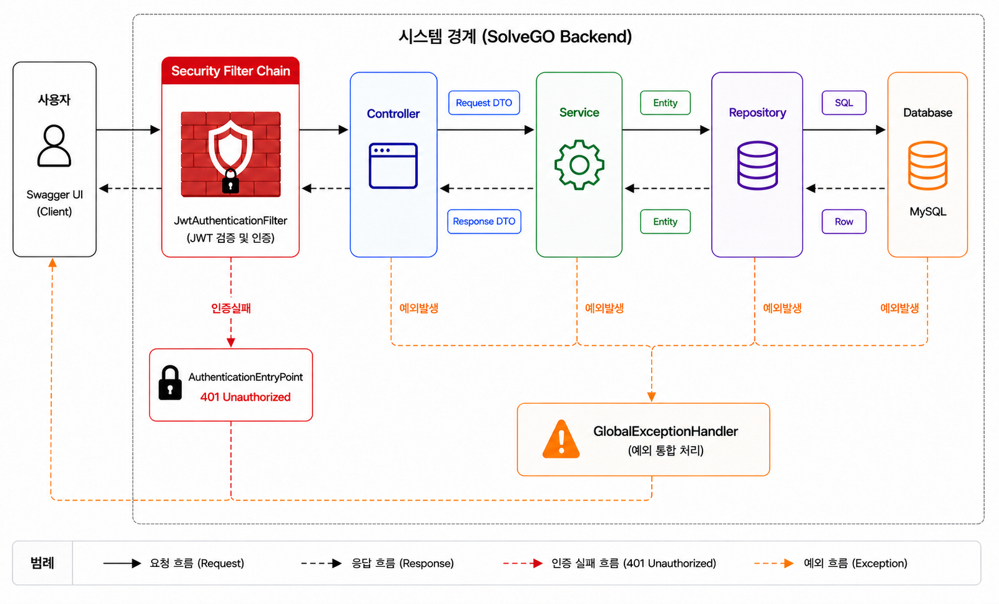
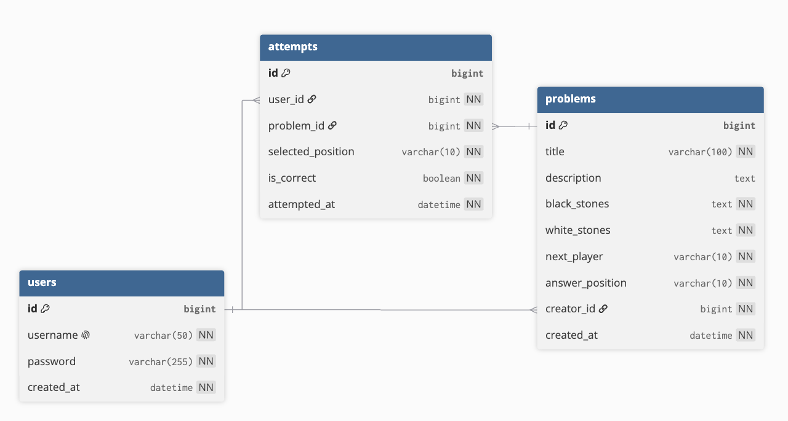
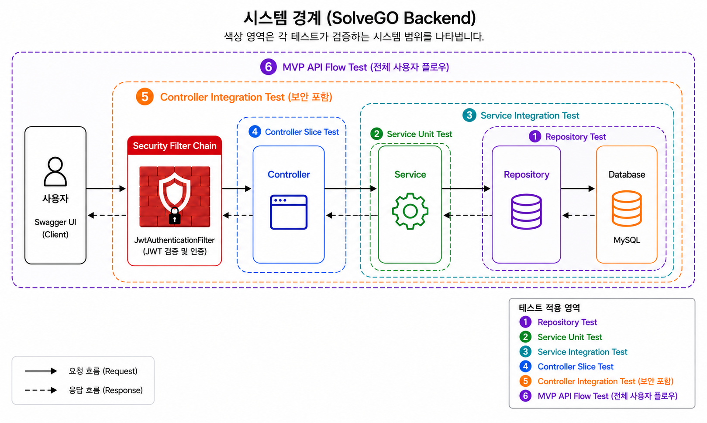
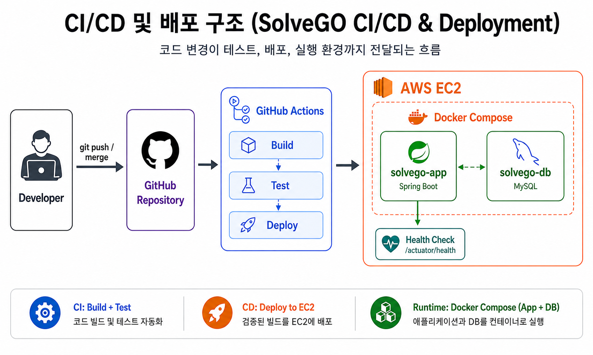

# SolveGO

> 사용자가 바둑 사활 문제를 등록하고 풀어볼 수 있는 백엔드 플랫폼

- [Swagger UI — 서버 운영 중에만 접근 가능](http://배포주소/swagger-ui/index.html)
- [개발 블로그](https://forwarder1121.tistory.com/category/Project/SolveGO)

---

## 프로젝트 소개


사용자가 바둑 사활 문제를 등록하고, 다른 사용자가 등록한 문제를 풀어볼 수 있는 플랫폼입니다.

개인 프로젝트로 [기획](https://forwarder1121.tistory.com/24),
[요구사항 정의](https://forwarder1121.tistory.com/25),
[API 설계](https://forwarder1121.tistory.com/26),
구현, 테스트, 문서화, 배포까지 전 과정을 혼자 진행했습니다.  
단순히 기능을 빠르게 구현하는 데 그치지 않고, 각 기술과 설계의 선택 이유를 이해하며 개발하였고, 이 과정에서 내린 주요 의사결정과 문제 해결 과정은 [블로그](https://forwarder1121.tistory.com/category/Project/SolveGO)에 상세하게 기록했습니다.


## 주요 기능

* 회원가입 및 로그인
* JWT 기반 사용자 인증
* 바둑 사활 문제 등록
* 문제 목록 및 상세 조회
* 착수 좌표 제출 및 정답 판별
* 사용자별 풀이 기록 저장
* 최근 오답 문제 조회

---

## 기술 스택

| 구분 | 기술 | 사용 목적 |
|---|---|---|
| Backend | `Spring Boot` | REST API 서버 구현 |
| Security | `Spring Security`, `JWT` | 사용자 인증 및 인가 |
| Database | `Spring Data JPA`, `MySQL` | 데이터 영속성 관리 |
| Migration | `Flyway` | 데이터베이스 스키마 변경 이력 관리 |
| Test | `JUnit 5`, `Mockito`, `MockMvc` | 단위 및 통합 테스트 |
| Container | `Docker`, `Docker Compose` | 애플리케이션과 DB 컨테이너 구성 |
| Deployment | `AWS EC2` | 애플리케이션 서버 배포 |
| CI/CD | `GitHub Actions` | 테스트 및 배포 자동화 |
| Documentation | `Swagger UI`, `OpenAPI` | API 문서화 및 직접 테스트 |

---

## 애플리케이션 아키텍처




사용자의 요청은 Spring Security Filter Chain에서 JWT 검증을 거친 뒤 Controller로 전달됩니다.  
Controller는 요청과 응답을 DTO로 분리하고, Service는 비즈니스 로직을 처리합니다.    
Repository는 Spring Data JPA를 통해 MySQL과 통신합니다.  
인증 실패는 `AuthenticationEntryPoint`에서 처리하며, 애플리케이션 내부에서 발생한 예외는 `GlobalExceptionHandler`에서 처리됩니다.  

---

## ERD



`User`는 여러 문제를 등록하고 여러 풀이 기록을 가질 수 있습니다.  
`Problem`은 여러 사용자의 풀이 기록을 가질 수 있으며, 각 풀이 결과는 `Attempt`에 독립적으로 저장됩니다.

### 관련 기록

- [요구사항 정의 및 ERD 설계](https://forwarder1121.tistory.com/25)
- [Spring Boot 설정과 엔티티 구현](https://forwarder1121.tistory.com/28)

---

## 주요 API

| 기능 | Method | Endpoint | 인증 |
|---|---|---|---|
| 회원가입 | POST | `/api/users` | 불필요 |
| 로그인 | POST | `/api/auth/login` | 불필요 |
| 문제 등록 | POST | `/api/problems` | 필요 |
| 문제 목록 조회 | GET | `/api/problems` | 불필요 |
| 문제 상세 조회 | GET | `/api/problems/{problemId}` | 불필요 |
| 문제 풀이 | POST | `/api/problems/{problemId}/attempts` | 필요 |
| 최근 오답 조회 | GET | `/api/users/me/wrong-problems` | 필요 |

전체 요청·응답 명세와 직접 실행 기능은
[Swagger UI](http://배포주소/swagger-ui/index.html)에서 확인할 수 있습니다.

### 관련 기록

- [회원가입 API 구현](https://forwarder1121.tistory.com/29)
- [로그인 인증 구현](https://forwarder1121.tistory.com/30)
- [JWT 발급 및 검증 구현](https://forwarder1121.tistory.com/31)
- [문제 등록 API 구현](https://forwarder1121.tistory.com/32)
- [문제 목록 조회 API 구현](https://forwarder1121.tistory.com/33)
- [문제 상세 조회 API 구현](https://forwarder1121.tistory.com/34)
- [문제 풀이 API 구현](https://forwarder1121.tistory.com/35)
- [최근 오답 문제 조회 API 구현](https://forwarder1121.tistory.com/36)
- [Swagger와 OpenAPI 문서화](https://forwarder1121.tistory.com/37)


---

## 테스트

각 계층의 책임과 전체 API 흐름을 검증하기 위해
단위 테스트와 통합 테스트를 단계적으로 구성했습니다.



### 테스트 구성

| 테스트 유형 | 검증 대상 |
|---|---|
| Repository 테스트 | JPA 쿼리와 데이터 조회·저장 동작 |
| Service 단위 테스트 | 비즈니스 로직과 예외 처리 |
| Service 통합 테스트 | Service, Repository, DB 간 연동 |
| Controller Slice 테스트 | HTTP 요청, 상태 코드, JSON 응답 |
| Controller 통합 테스트 | Security Filter Chain을 포함한 실제 API 동작 |
| MVP API Flow 테스트 | 회원가입부터 문제 풀이와 오답 조회까지의 전체 사용자 흐름 |


### 관련 기록

- [Repository Slice Test](https://forwarder1121.tistory.com/38)
- [Service Unit Test & Integration Test](https://forwarder1121.tistory.com/39)
- [Controller Slice Test & Integration Test](https://forwarder1121.tistory.com/40)

---

## CI/CD 및 배포

GitHub Actions를 이용해 `main` 브랜치에 반영된 코드를 자동으로 테스트하고 AWS EC2에 배포하도록 구성했습니다.



### 배포 흐름

작업 브랜치 개발 → `main` 브랜치 병합 → 테스트 및 빌드 → AWS EC2 배포 → Docker Compose로 애플리케이션과 MySQL 재실행 → `/actuator/health`로 배포 상태 확인

현재 자동 배포와 Health Check까지 구성했으며, 이미지 버전 관리와 자동 롤백은 향후 적용할 예정입니다.

### 관련 기록

- [GitHub 저장소와 CI 구축](https://forwarder1121.tistory.com/41)
- [Docker 패키징과 EC2 수동 배포](https://forwarder1121.tistory.com/42)
- [GitHub Actions 기반 CD 구축](https://forwarder1121.tistory.com/43)


---

## 트러블슈팅

### Validation 실패가 `400`이 아닌 `401`로 반환되는 문제

문제 등록 API에서 잘못된 요청 본문을 전달했을 때,
`@Valid` 검증 실패로 `400 Bad Request`가 반환되어야 했지만
`401 Unauthorized`가 반환되는 문제가 발생했습니다.

원인을 추적한 결과, Validation 예외 이후 발생한 `ERROR dispatch`가
Spring Security의 인증 대상에 포함되었고,
JWT 필터는 `ERROR dispatch`에서 다시 실행되지 않아 인증되지 않은 요청으로 처리되고 있었습니다.

`MethodArgumentNotValidException`을 `GlobalExceptionHandler`에서 처리하고,
에러 응답 생성을 위한 내부 dispatch는 인증 대상에서 제외했습니다.

```java
.dispatcherTypeMatchers(DispatcherType.ERROR).permitAll()
```

그 결과 입력값 검증 실패는 `400 Bad Request`,
실제 인증 실패는 `401 Unauthorized`로 구분되어 반환되도록 수정했습니다.

- [ERROR Dispatch 트러블슈팅 상세 기록](https://forwarder1121.tistory.com/32)

### 문제 목록 조회의 N+1 문제

문제 목록 응답에 작성자 이름이 포함되어 있어,
각 `Problem`의 지연 로딩된 `creator`를 조회하는 과정에서
목록 조회 1번과 작성자 조회 N번이 발생할 수 있었습니다.

Fetch Join을 적용해 `Problem`과 `User`를 한 번의 쿼리로 조회하도록 개선했습니다.

```java
@Query("""
    select p
    from Problem p
    join fetch p.creator
    order by p.createdAt desc
""")
List<Problem> findAllWithCreatorOrderByCreatedAtDesc();
```

이를 통해 문제 개수에 따라 추가 쿼리가 증가하는 문제를 방지했습니다.

- [N+1 문제 해결 상세 기록](https://forwarder1121.tistory.com/33)


---
## 프로젝트 구조

도메인별로 코드를 구성하고, 공통 설정·보안·예외 처리는 `global` 패키지로 분리했습니다.

```text
src/main/java/com/kdh/solvego
├── domain                         # 도메인별 비즈니스 코드
│   ├── auth                       # 로그인 및 JWT 인증
│   │   ├── controller
│   │   ├── service
│   │   └── dto
│   │
│   ├── user                       # 사용자 관리
│   │   ├── controller
│   │   ├── service
│   │   ├── repository
│   │   ├── entity
│   │   └── dto
│   │
│   ├── problem                    # 바둑 문제 관리
│   │   ├── controller
│   │   ├── service
│   │   ├── repository
│   │   ├── entity
│   │   └── dto
│   │
│   ├── attempt                    # 풀이 및 풀이 기록 관리
│   │   ├── controller
│   │   ├── service
│   │   ├── repository
│   │   ├── entity
│   │   └── dto
│   │
│   └── common
│       └── vo                     # 공통 값 객체
│
└── global                         # 전역 공통 기능
    ├── config                     # 애플리케이션 설정
    ├── security                   # JWT 인증 처리
    └── exception                  # 전역 예외 처리
```

---


## 실행 방법

### 1. 저장소 복제

```bash
git clone https://github.com/SolveGO/solvego-backend.git
cd solvego-backend
```


### 2. 환경변수 설정

프로젝트 루트에 `.env` 파일을 생성합니다.

```env
MYSQL_DATABASE=solvego
MYSQL_USER=solvego
MYSQL_PASSWORD=your_password
MYSQL_ROOT_PASSWORD=your_root_password
JWT_SECRET=your_jwt_secret
```

### 3. 애플리케이션 실행

```bash
docker compose up -d --build
```

### 4. 실행 확인

* Swagger UI: `http://localhost:8080/swagger-ui/index.html`
* Health Check: `http://localhost:8080/actuator/health`


---


## 향후 개선 사항

- k6를 활용한 부하 테스트 및 병목 분석
- 페이징, 인덱스, 쿼리 개선 전후의 성능 비교
- Prometheus와 Grafana 기반 모니터링 구축
- Redis 캐싱 적용 및 성능 변화 검증
- Docker 이미지 버전 관리, 자동 롤백, 무중단 배포 도입
- 장애 및 배포 실패 알림 체계 구축

