<a id="top"></a>
# SolveGO

사용자가 바둑 사활 문제를 등록하고 풀어볼 수 있는 플랫폼

<p align="center">
  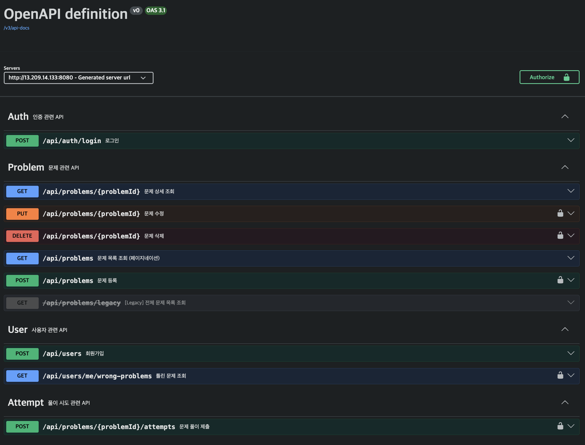
</p>

[API 문서 (Swagger UI)](http://13.209.14.133:8080/swagger-ui/index.html) *(서버 운영 중에만 접근 가능)*

[개발 블로그](https://forwarder1121.tistory.com/category/Project/SolveGO)


목차는 아래와 같으며, 모든 내용에 대한 상세한 설명은 [개발 블로그](https://forwarder1121.tistory.com/category/Project/SolveGO)에서 확인하실 수 있습니다.

## 목차

- [프로젝트 소개](#프로젝트-소개)
- [주요 기능](#주요-기능)
- [기술 스택](#기술-스택)
- [애플리케이션 아키텍처](#애플리케이션-아키텍처)
- [ERD](#erd)
- [주요 API](#주요-api)
- [테스트](#테스트)
  - [테스트 구성](#테스트-구성)
- [CI/CD 및 배포](#cicd-및-배포)
  - [배포 흐름](#배포-흐름)
- [성능 개선 및 검증](#성능-개선-및-검증)
  - [문제 목록 조회 인덱스 최적화](#문제-목록-조회-인덱스-최적화)
  - [페이지네이션 적용](#페이지네이션-적용)
  - [Redis 캐시 적용](#redis-캐시-적용)
  - [k6 부하 테스트](#k6-부하-테스트)
  - [Prometheus와 Grafana 모니터링](#prometheus와-grafana-모니터링)
- [트러블슈팅](#트러블슈팅)
  - [회원가입 동시 요청으로 인한 Race Condition](#회원가입-동시-요청으로-인한-race-condition)
  - [JPA 벌크 쿼리 이후 영속성 컨텍스트 불일치](#jpa-벌크-쿼리-이후-영속성-컨텍스트-불일치)
  - [Validation 실패가 400이 아닌 401로 반환되는 문제](#validation-실패가-400이-아닌-401로-반환되는-문제)
  - [문제 목록 조회의 N+1 문제](#문제-목록-조회의-n1-문제)
- [프로젝트 구조](#프로젝트-구조)

---

## 프로젝트 소개


사용자가 바둑 사활 문제를 등록하고, 다른 사용자가 등록한 문제를 풀어볼 수 있는 플랫폼입니다.

개인 프로젝트로 [기획](https://forwarder1121.tistory.com/24),
[요구사항 정의](https://forwarder1121.tistory.com/25),
[API 설계](https://forwarder1121.tistory.com/26),
구현, 테스트, 문서화, 배포, 성능 개선/측정 전 과정을 혼자서 진행했고, 
이 과정에서 내린 주요 의사결정과 문제 해결 과정은 [블로그](https://forwarder1121.tistory.com/category/Project/SolveGO)에 상세하게 기록되어 있습니다.


## 주요 기능

* 회원가입 및 로그인
* JWT 기반 사용자 인증 및 인가
* 바둑 사활 문제 등록/조회/수정/삭제 (CRUD)
* 작성자 기반 문제 수정/삭제 권한 검증
* 문제 목록 페이지네이션 및 상세 조회
* 착수 좌표 제출 및 정답 판별
* 사용자별 풀이 기록 저장
* 최근 오답 문제 조회

---

## 기술 스택

| 구분               | 기술                                                | 사용 목적                                   |
| ---------------- |---------------------------------------------------|-----------------------------------------|
| Backend          | `Spring Boot`                                     | REST API 서버 구현                          |
| Security         | `Spring Security`, `JWT`                          | 사용자 인증 및 인가                             |
| Database         | `Spring Data JPA`, `MySQL`                        | 데이터 영속성 관리                              |
| Cache            | `Redis`,      `Spring Cache`                        | 문제 목록 조회 캐싱 및 데이터베이스 부하 감소              |
| Migration        | `Flyway`                                          | 데이터베이스 스키마 변경 이력 관리                     |
| Test | `JUnit 5`, `Mockito`, `MockMvc`, `Testcontainers` | 계층별 단위, 통합 테스트 및 실제 Redis 컨테이너 기반 캐시 검증 |
| Performance Test | `k6`                                              | 부하 테스트와 캐시 적용 전후 성능 비교                  |
| Monitoring       | `Prometheus`, `Grafana`                           | 애플리케이션 및 인프라 지표 수집/시각화                  |
| Container        | `Docker`, `Docker Compose`                        | 애플리케이션, MySQL, Redis, 모니터링 환경 구성        |
| Deployment       | `AWS EC2`                                         | 애플리케이션 서버 클라우드 배포                       |
| CI/CD            | `GitHub Actions`                                  | 테스트 및 배포 자동화                            |
| Documentation    | `Swagger UI`, `OpenAPI`                           | API 문서화                        |


---

## 애플리케이션 아키텍처


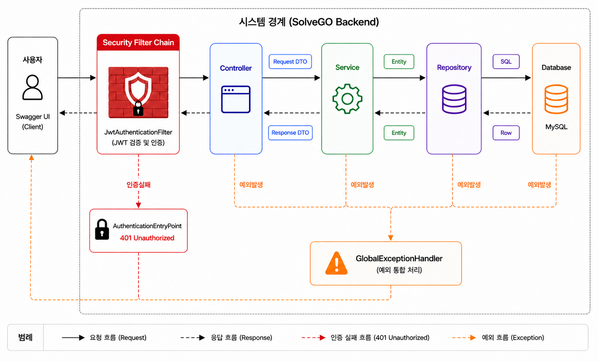

사용자의 요청은 Spring Security Filter Chain에서 JWT 검증을 거친 뒤 Controller로 전달됩니다.  
Controller를 DTO를 변환하여 내부 통신은 DTO로 이루지고, Service는 비즈니스 로직을 처리합니다.    
Repository는 Spring Data JPA를 통해 MySQL,Redis과 통신합니다.  
인증 실패는 `AuthenticationEntryPoint`에서 처리하며, 애플리케이션 내부에서 발생한 예외는 `GlobalExceptionHandler`에서 처리됩니다.  

---

## ERD

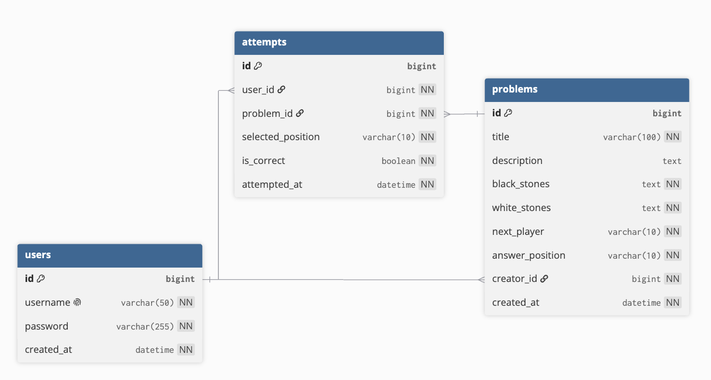

`User`는 여러 문제를 등록하고 여러 풀이 기록을 가질 수 있습니다.  
`Problem`은 여러 사용자의 풀이 기록을 가질 수 있으며, 각 풀이 결과는 `Attempt`에 독립적으로 저장됩니다.

### 관련 기록

- [요구사항 정의 및 ERD 설계](https://forwarder1121.tistory.com/25)
- [Spring Boot 설정과 엔티티 구현](https://forwarder1121.tistory.com/28)

---

## 주요 API

| 기능 | Method | Endpoint | 인증 |
|---|---|---|---|
| 회원가입 | POST | `/api/users` | 불필요 |
| 로그인 | POST | `/api/auth/login` | 불필요 |
| 문제 등록 | POST | `/api/problems` | 필요 |
| 문제 목록 조회 (페이지네이션) | GET | `/api/problems?page={page}&size={size}` | 불필요 |
| 문제 상세 조회 | GET | `/api/problems/{problemId}` | 불필요 |
| 문제 수정 | PUT | `/api/problems/{problemId}` | 필요 |
| 문제 삭제 | DELETE | `/api/problems/{problemId}` | 필요 |
| 문제 풀이 | POST | `/api/problems/{problemId}/attempts` | 필요 |
| 최근 오답 조회 | GET | `/api/users/me/wrong-problems` | 필요 |

전체 요청/응답 명세와 API 테스트는 [Swagger UI](http://13.209.14.133:8080/swagger-ui/index.html)에서 확인하실 수 있습니다.
실제 테스트 또한 가능합니다.

### 관련 기록

- [회원가입 API 구현](https://forwarder1121.tistory.com/29)
- [로그인 인증 구현](https://forwarder1121.tistory.com/30)
- [JWT 발급 및 검증 구현](https://forwarder1121.tistory.com/31)
- [문제 등록 API 구현](https://forwarder1121.tistory.com/32)
- [문제 목록 조회 API 구현](https://forwarder1121.tistory.com/33)
- [문제 상세 조회 API 구현](https://forwarder1121.tistory.com/34)
- [문제 풀이 API 구현](https://forwarder1121.tistory.com/35)
- [최근 오답 문제 조회 API 구현](https://forwarder1121.tistory.com/36)
- [문제 수정, 삭제 API 구현](https://forwarder1121.tistory.com/47) 
- [Swagger와 OpenAPI 문서화](https://forwarder1121.tistory.com/37)


---

## 테스트

아래 사진과 같이 새로운 컴포넌트에 대한 단위 테스트를 먼저 실행하고, 그 뒤 통합 테스트를 실행하여 각 컴포넌트가 시스템에 적용되었을 때, 문제가 없는지 확인하였고, 
이를 반복하여 테스트 적용 범위가 전체 시스템이 되도록 확장해 나갔습니다.

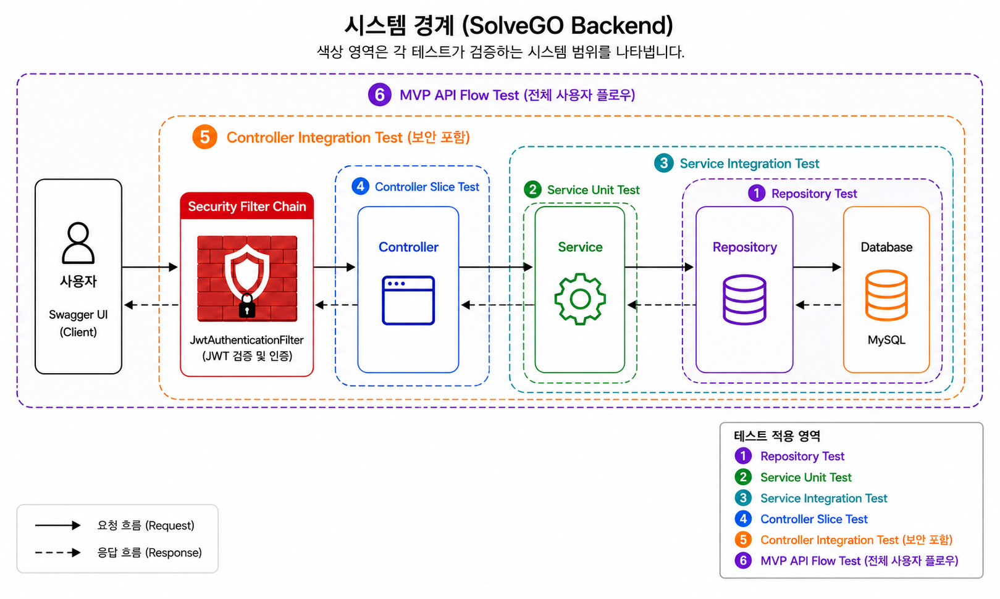

### 테스트 구성

| 테스트 유형               | 검증 대상 |
|----------------------|---|
| Repository Slice 테스트 | JPA 쿼리와 데이터 조회·저장 동작 |
| Service 단위 테스트       | 비즈니스 로직과 예외 처리 |
| Service 통합 테스트       | Service, Repository, DB 간 연동 |
| Controller Slice 테스트 | HTTP 요청, 상태 코드, JSON 응답 |
| Controller 통합 테스트    | Security Filter Chain을 포함한 실제 API 동작 |
| Cache 통합 테스트         | Redis 캐시 저장, 조회, TTL, 조건부 캐싱 및 무효화 검증 |
| MVP API Flow 테스트     | 회원가입부터 문제 풀이와 오답 조회까지의 전체 사용자 흐름 |

### 관련 기록

- [Repository Slice Test](https://forwarder1121.tistory.com/38)
- [Service Unit Test & Integration Test](https://forwarder1121.tistory.com/39)
- [Controller Slice Test & Integration Test](https://forwarder1121.tistory.com/40)


---

## CI/CD 및 배포

GitHub Actions를 이용해 `main` 브랜치에 merge된 코드를 자동으로 테스트하고, Docker 이미지를 빌드한 뒤 AWS EC2 환경에 자동 배포하도록 구성했습니다.

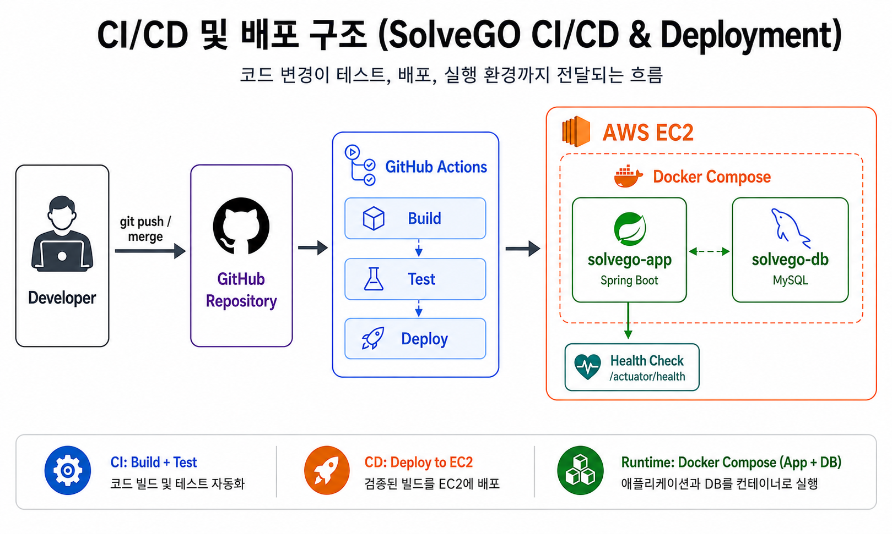

### 배포 흐름

작업 브랜치 개발
→ `main` 브랜치 merge
→ GitHub Actions 테스트 및 빌드
→ AWS EC2 배포
→ Docker Compose로 Spring Boot, MySQL, Redis, Prometheus, Grafana 실행
→ `/actuator/health`를 통한 배포 상태 확인

### 관련 기록

- [GitHub 저장소와 CI 구축](https://forwarder1121.tistory.com/41)
- [Docker 패키징과 EC2 수동 배포](https://forwarder1121.tistory.com/42)
- [GitHub Actions 기반 CD 구축](https://forwarder1121.tistory.com/43)


---

## 성능 개선 및 검증

문제 데이터가 증가하고 조회 요청이 집중되는 상황에서도 안정적으로 동작할 수 있도록,
데이터베이스 조회 구조를 개선하고 Redis 캐시를 적용했습니다.
 각 변경 사항은 `EXPLAIN ANALYZE`, 반복 실행 시간 측정, k6 부하 테스트,
Prometheus와 Grafana 모니터링을 통해 실제 효과를 확인했습니다.

### 문제 목록 조회 인덱스 최적화

초기 문제 목록 API는 최신 문제를 조회하기 위해 다음과 같이
`created_at`을 기준으로 내림차순 정렬했습니다.

```sql
SELECT *
FROM problems
ORDER BY created_at DESC
LIMIT 20;
```

문제 데이터 10,001건을 기준으로 `created_at` 인덱스 적용 전후의 쿼리를
각각 100회 실행하여 평균 실행 시간을 비교했습니다.

| 구분 | 평균 실행 시간 |
|---|---:|
| 인덱스 미적용 | 10.7839ms |
| `created_at` 인덱스 적용 | 0.8125ms |

인덱스 적용 후 평균 실행 시간이 약 13배 단축되었습니다.

그러나 `created_at` 보조 인덱스는 실제 행을 조회하기 위해
Primary Key 인덱스를 다시 탐색하는 PK Lookup이 필요했습니다.
SolveGO에서는 문제 ID가 생성 순서를 나타내므로, 최신 문제를 가장 큰 ID로 정의할 수 있었습니다.

이에 따라 `created_at DESC`와 `id DESC` 조회를 각각 100회 비교했습니다.

| 정렬 기준 | 평균 실행 시간 |
|---|---:|
| `created_at DESC` | 1.0096ms |
| `id DESC` | 1.0005ms |

두 방식의 차이는 작았지만 Primary Key를 직접 사용하는 `id DESC`가 근소하게 빨랐고,
추가 보조 인덱스를 유지할 필요도 없었습니다.

최종적으로 문제 목록의 최신순 기준을 `id DESC`로 변경하고,
Flyway 마이그레이션을 통해 `created_at` 인덱스를 제거했습니다.

### 관련 기록

- [DB 인덱스 도입](https://forwarder1121.tistory.com/44)
- [DB 인덱스 제거](https://forwarder1121.tistory.com/45)


### 페이지네이션 적용

초기 문제 목록 API는 등록된 문제 전체를 한 번에 조회했습니다.
이 방식은 데이터가 증가할수록 DB 조회량, 객체 생성량, 응답 데이터 크기가 함께 증가하는 문제가 있습니다.

이를 해결하기 위해 Spring Data JPA의 `Pageable`과 `Page`를 이용한
Offset 기반 페이지네이션을 적용했습니다.

```http
GET /api/problems?page=0&size=20
```

응답에는 문제 목록과 함께 현재 페이지 및 전체 페이지 메타 데이터를 제공하도록 설계했습니다.

<p align="center">
  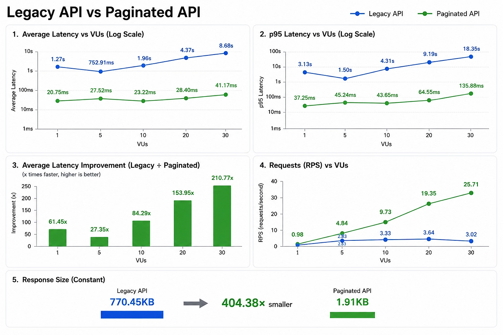
</p>


k6 부하 테스트 결과,
페이지네이션 적용 후 응답 크기가 약 **404배 감소**했으며,
평균 응답 시간과 p95 지연 시간이 크게 감소했습니다.

응답 데이터 크기가 일정하게 유지되면서
동시 요청이 증가해도 처리량(RPS)이 안정적으로 증가하는 것을 확인할 수 있습니다.

### 관련 기록

- [페이지네이션 API 구현과 성능 검증](https://forwarder1121.tistory.com/46)


### Redis 캐시 적용

문제 목록 중 첫 화면에 해당하는 최신 페이지에 조회 요청이 집중될 것으로 예상되었습니다.
이에 따라, 동일한 데이터를 반복해서 MySQL에서 조회하지 않도록 Spring Cache와 Redis를 이용한
Cache-Aside 방식의 캐시를 적용했습니다.

```text
요청
→ Redis 캐시 조회
→ Cache Hit: 캐시 데이터 반환
→ Cache Miss: MySQL 조회
→ 조회 결과를 Redis에 저장
→ 응답 반환
```

모든 페이지를 캐싱하지 않고 다음 조건을 만족하는 요청만 캐시하도록 제한했습니다.

- 페이지 번호가 0, 1, 2 중 하나인 경우
- 페이지 크기가 20인 경우
- 캐시 TTL은 10분

캐시 키 예시
```text
problemPages::page:0:size:20
problemPages::page:1:size:20
problemPages::page:2:size:20
```

문제가 등록,수정,삭제되면 최신 문제 목록의 내용과 페이지 경계가 변경될 수 있으므로, 해당 연산이 발생될 경우
문제 목록 캐시를 무효화하도록 했습니다. 이는 Testcontainers로 redis 컨테이너를 실행하는 통합 테스트를 작성하여 동작을 검증했습니다.


### k6 부하 테스트

Redis 캐시가 실제 운영 환경의 응답 성능에 미치는 영향을 확인하기 위해
AWS EC2에 배포된 문제 목록 API를 대상으로 k6 부하 테스트를 수행했습니다.
<p align="center">
  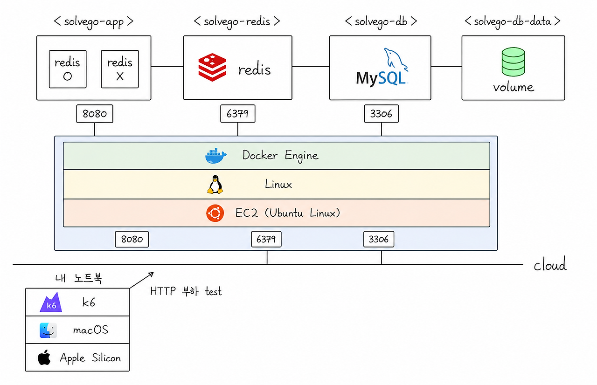
</p>

캐시 적용 여부 외의 조건을 동일하게 유지하기 위해 Python 자동화 스크립트로
다음 과정을 실행했습니다.

```text
캐시 ON/OFF 설정 → EC2 애플리케이션 재시작 → /actuator/health 확인 → Redis 캐시 초기화 → 캐시 워밍업 → Redis 키 생성 확인 → k6 실행 → JSON 결과 저장
```

자동화 스크립트는 `CACHE_TYPE=none`과 `CACHE_TYPE=redis`를 전환하고,
EC2의 애플리케이션 컨테이너를 다시 생성한 후 k6 결과를 회차별 JSON 파일로 저장하도록 했으며, 이를 집계한 결과는 아래와 같습니다.

<p align="center">
  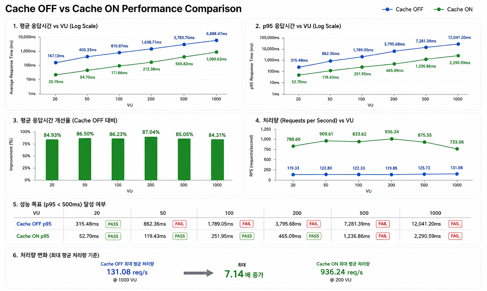
</p>

20 ~ 1,000 VU 구간에서 Redis 캐시 적용 후 평균 응답 시간은
Cache OFF 대비 약 84.31~87.04% 감소했습니다.

p95 응답 시간 역시 모든 VU 구간에서 감소했으며,
성능 목표인 p95 500ms 미만을 Cache OFF에서는 20 VU까지만 만족한 반면,
Cache ON에서는 200 VU까지 만족했습니다.

최대 평균 처리량은 Cache OFF의 131.08 req/s에서
Cache ON의 936.24 req/s로 증가하여 약 7.14배 향상되었습니다.
또한 두 조건 모두 테스트 중 요청 실패는 발생하지 않았습니다.


### 관련 기록
- [Redis 도입과 성능 검증](https://forwarder1121.tistory.com/48)

### Prometheus와 Grafana 모니터링

k6 결과만으로는 애플리케이션 내부에서 어떤 변화가 발생했는지 파악하기 어렵기 때문에,
Spring Boot Actuator와 Micrometer가 제공하는 메트릭을 Prometheus로 수집하고
Grafana에서 시각화했습니다.

Docker Compose를 통해 다음 서비스를 함께 실행합니다.

```text
Spring Boot
MySQL
Redis
Prometheus
Grafana
```

Grafana 대시보드에는 다음 지표를 구성했습니다.

- Process CPU Usage
- HTTP Response Time
- HTTP Requests per Second
- JVM Heap Used
- JVM Thread 상태
- Garbage Collection 관련 지표

실제 대시보드에서는 `process_cpu_usage`,
`http_server_requests_seconds_sum`,
`http_server_requests_seconds_count`,
`jvm_memory_used_bytes` 등의 Prometheus 메트릭을 사용하고 있습니다.

이를 통해 부하 테스트 중 응답 시간과 처리량뿐 아니라,
CPU 사용량, JVM Heap 증가와 GC에 따른 메모리 회수,
스레드 상태 등을 함께 관찰할 수 있도록 구성했습니다.


---
## 트러블슈팅

### 회원가입 동시 요청으로 인한 Race Condition

회원가입 로직에서는 먼저 동일한 username이 존재하는지 확인한 뒤
사용자를 저장하도록 구현했습니다.

```java
if (userRepository.existsByUsername(request.username())) {
    throw new DuplicateUsernameException();
}

userRepository.save(user);
```

단일 요청에서는 정상적으로 중복 가입을 방지했지만,
같은 username으로 여러 요청이 거의 동시에 들어오면 다음과 같은 문제가 발생할 수 있었습니다.

```text
요청 A: username 중복 확인 → 존재하지 않음
요청 B: username 중복 확인 → 존재하지 않음
(context switching!)
요청 A: 사용자 저장
요청 B: 사용자 저장
```

중복 확인과 저장은 하나의 원자적 연산이 아니므로,
애플리케이션 레벨의 사전 조회만으로는 동시 요청을 완전히 막을 수 없었습니다.

사용 가능한 동시성 제어 방법의 통제 범위를 비교한 결과,
현재 요구사항에는 DB 수준의 제약조건이 가장 적절하다고 판단했습니다.

<p align="center">
  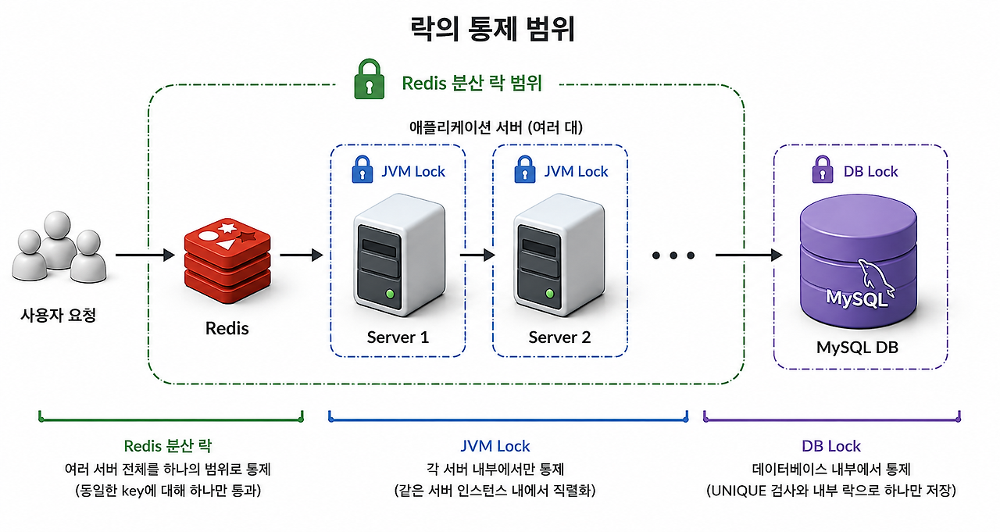
</p>

- **JVM Lock**은 하나의 애플리케이션 인스턴스 내부에서만 동작하므로, 서버가 여러 대인 환경에서는 다른 인스턴스의 요청을 제어할 수 없습니다.
- **Redis 분산 락**은 여러 서버에 걸친 요청까지 제어할 수 있지만, 현재 요구사항은 **단일 서버**에서만 무결성을 보장하는 것이므로 운영 복잡도에 비해 얻는 이점이 크지 않았습니다.
- **DB UNIQUE 제약조건(락)**은 username의 유일성을 데이터베이스 자체에서 보장할 수 있으며, 서버가 몇 대로 확장되더라도 동일한 방식으로 동작하나, 많은 요청이 존재하는 경우 DB conntection을 낭비할 수 있었습니다.

현재 서버의 운영 방식이 단일 인스턴스이고, 회원가입 요청은 많은 요청이 예상되지 않으므로, DB UNIQUE 제약조건(락)을 선택하였습니다.


```sql
username varchar(50) not null unique
```

동시에 같은 username을 저장하려는 요청이 발생하면 데이터베이스는 내부 락을 통해 하나의 요청만 저장하고 나머지 요청을 거부합니다.

발생한 `DataIntegrityViolationException`은
`DuplicateUsernameException`으로 변환하여
클라이언트에는 일관된 `409 Conflict`를 반환하도록 처리했습니다.


### 관련 기록

- [회원가입 Race Condition 트러블슈팅](https://forwarder1121.tistory.com/49)

### JPA 벌크 쿼리 이후 영속성 컨텍스트 불일치

문제 삭제 API에서 해당 문제를 참조하는 풀이 기록을 먼저 삭제한 뒤,
문제 엔티티를 삭제하도록 구현했습니다.

풀이 기록이 많아질 경우 엔티티를 하나씩 조회하여 삭제하는 방식은
불필요한 조회와 다수의 DELETE 쿼리를 발생시킬 수 있으므로,
JPQL 벌크 삭제 쿼리를 사용했습니다.

```java
@Modifying
@Query("""
    delete from Attempt a
    where a.problem.id = :problemId
""")
void deleteAllByProblemId(Long problemId);
````

여기서 문제 삭제 요청 자체는 `204 No Content`로 정상 처리되었지만,
같은 트랜잭션 안에서 삭제된 문제를 다시 조회하는 통합 테스트에서
기대한 `404 Not Found` 대신 다음 예외가 발생했습니다.

```text
org.hibernate.TransientObjectException:
persistent instance references an unsaved transient instance of Problem
```

원인은 JPQL 벌크 쿼리가 **영속성 컨텍스트를 거치지 않고**
데이터베이스에 직접 DELETE 쿼리를 실행한다는 점이었습니다.

데이터베이스에서는 `Attempt`가 삭제되었지만,
영속성 컨텍스트에는 여전히 `Problem`을 참조하는 `Attempt` 엔티티가 남아 있었습니다.

이 상태에서 트랜잭션 커밋이나 후속 조회로 자동 Flush가 발생하면,
Hibernate는 영속성 컨텍스트에 남아 있는 `Attempt`가
이미 삭제된 `Problem`을 참조하고 있다고 판단하여
`TransientObjectException`을 발생시킨 것이였습니다.


이를 해결하기 위해 `@Modifying`에 다음 옵션을 적용했습니다.

```java
@Modifying(
    clearAutomatically = true
)
@Query("""
    delete from Attempt a
    where a.problem.id = :problemId
""")
void deleteAllByProblemId(Long problemId);
```
`clearAutomatically = true` : 
벌크 쿼리 실행 후 영속성 컨텍스트를 초기화하여 DB와 불일치하는 엔티티를 제거합니다.

<p align="center">
  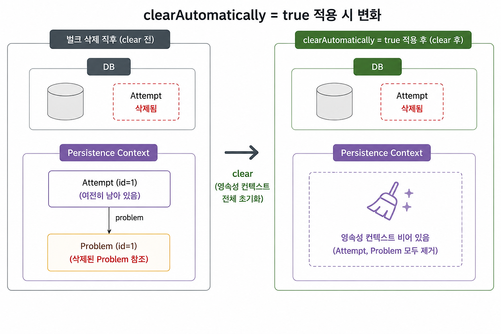
</p>

이로써 벌크 쿼리 실행 시 발생하는 DB, Persistence Context 간의 불일치를 해결했습니다.


### 관련 기록

* [JPA 벌크 쿼리의 영속성 컨텍스트 불일치 해결](https://forwarder1121.tistory.com/47)


### Validation 실패가 `400`이 아닌 `401`로 반환되는 문제

<p align="center">
  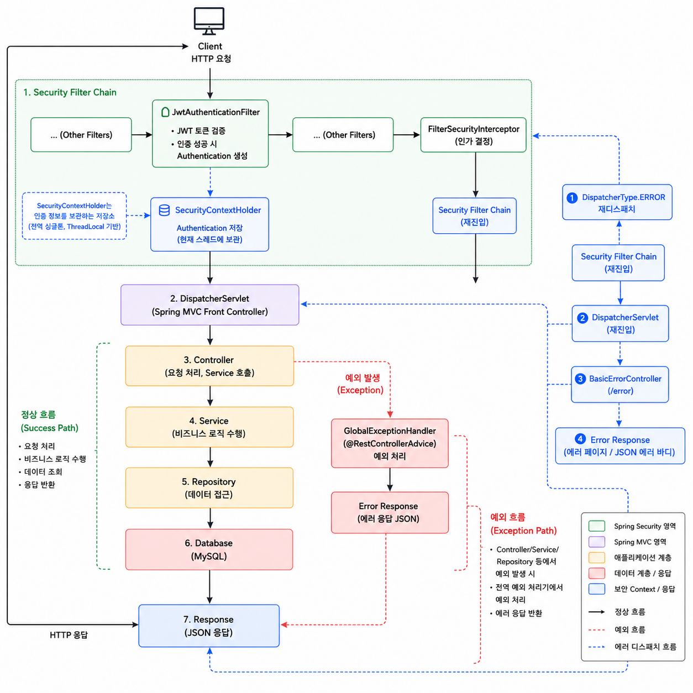
</p>

문제 등록 API에서 잘못된 요청 본문을 전달했을 때,
`@Valid` 검증 실패로 `400 Bad Request`가 반환되어야 했지만
`401 Unauthorized`가 반환되는 문제가 발생했습니다.

원인을 추적한 결과, Validation 예외 이후 발생한 `ERROR dispatch`가
Spring Security의 인증 대상에 포함되었고,
JWT 필터는 `ERROR dispatch`에서 다시 실행되지 않아 인증되지 않은 요청으로 처리되고 있었습니다.

`MethodArgumentNotValidException`을 `GlobalExceptionHandler`에서 처리하고,
에러 응답 생성을 위한 내부 dispatch는 인증 대상에서 제외했습니다.

```java
.dispatcherTypeMatchers(DispatcherType.ERROR).permitAll()
```

그 결과 입력값 검증 실패는 `400 Bad Request`,
실제 인증 실패는 `401 Unauthorized`로 구분되어 반환되도록 수정했습니다.

### 관련 기록
- [ERROR Dispatch 트러블슈팅 상세 기록](https://forwarder1121.tistory.com/32)

### 문제 목록 조회의 N+1 문제

<p align="center">
  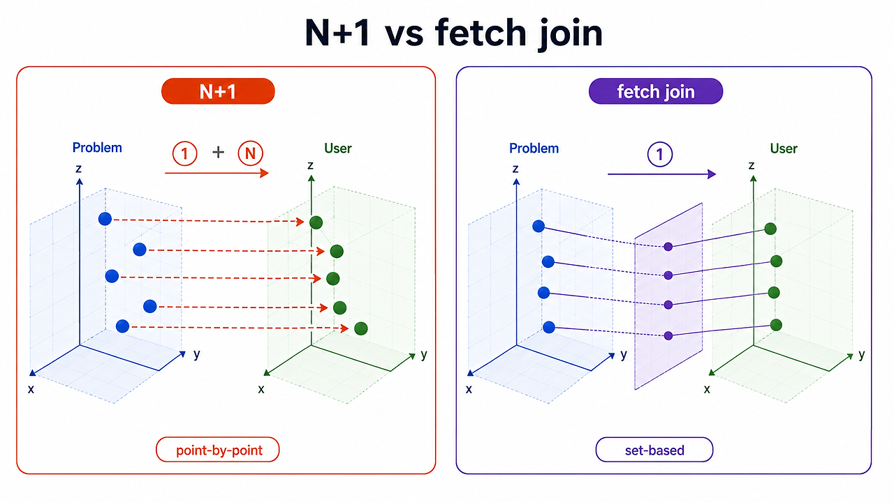
</p>

문제 목록 응답에 작성자 이름이 포함되어 있어,
각 `Problem`의 지연 로딩된 `creator`를 조회하는 과정에서
목록 조회 1번과 작성자 조회 N번이 발생할 수 있었습니다.

Fetch Join을 적용해 `Problem`과 `User`를 한 번의 쿼리로 조회하도록 개선했습니다.

```java
@Query("""
    select p
    from Problem p
    join fetch p.creator
    order by p.createdAt desc
""")
List<Problem> findAllWithCreatorOrderByCreatedAtDesc();
```

이를 통해 문제 개수에 따라 추가 쿼리가 증가하는 문제를 방지했습니다.

### 관련 기록
- [N+1 문제 해결 상세 기록](https://forwarder1121.tistory.com/33)


---
## 프로젝트 구조

도메인별로 코드를 구성하고, 공통 설정·보안·예외 처리는 `global` 패키지로 분리했습니다.

```text
src/main/java/com/kdh/solvego
├── domain                         # 도메인별 비즈니스 코드
│   ├── auth                       # 로그인 및 JWT 인증
│   │   ├── controller
│   │   ├── service
│   │   └── dto
│   │
│   ├── user                       # 사용자 관리
│   │   ├── controller
│   │   ├── service
│   │   ├── repository
│   │   ├── entity
│   │   └── dto
│   │
│   ├── problem                    # 바둑 문제 관리
│   │   ├── controller
│   │   ├── service
│   │   ├── repository
│   │   ├── entity
│   │   └── dto
│   │
│   ├── attempt                    # 풀이 및 풀이 기록 관리
│   │   ├── controller
│   │   ├── service
│   │   ├── repository
│   │   ├── entity
│   │   └── dto
│   │
│   └── common
│       └── vo                     # 공통 값 객체
│
└── global                         # 전역 공통 기능
    ├── config                     # 애플리케이션 설정
    ├── security                   # JWT 인증 처리
    └── exception                  # 전역 예외 처리
```


